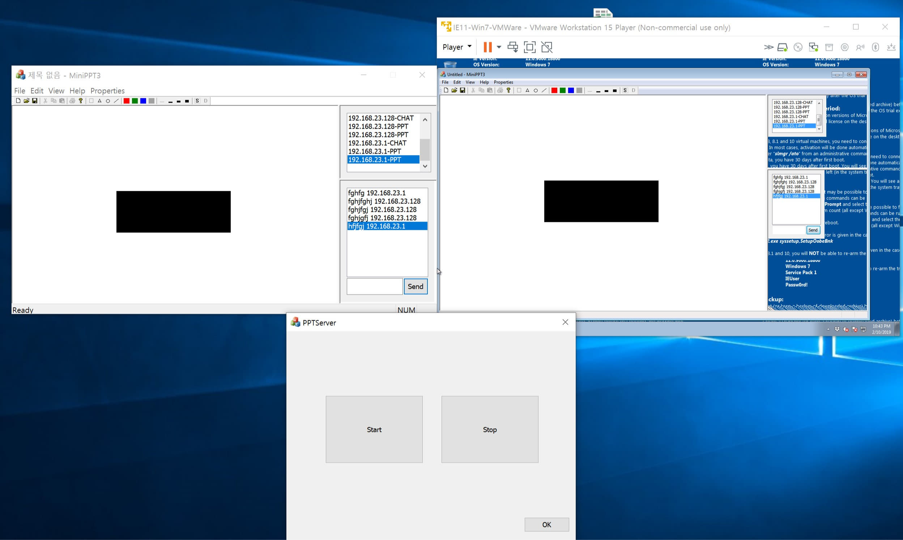

# MiniPPT

MFC 기반의 클라이언트/서버 드로잉 프로그램입니다. 도형 편집 정보와 채팅 메시지를 TCP/IP로 전달하고, 수신한 데이터를 화면 상태에 반영하도록 구현했습니다.



## Overview

클라이언트에서 마우스로 입력한 좌표와 도형 속성을 서버로 전송하고, 다시 전달받은 데이터를 기반으로 다른 클라이언트에서도 동일한 도형 상태를 반영하는 구조를 실습한 프로젝트입니다.

채팅 메시지와 PPT 데이터를 하나의 사용자 정의 헤더로 구분하고, 도형 종류·색상·작업 유형(New / Modify / Delete) 등을 비트 필드로 표현했습니다.

## Key Features

- 사각형, 삼각형, 원형, 선 도형 생성
- 기존 도형 선택 후 수정 및 삭제
- 도형 좌표와 속성의 TCP/IP 송수신
- 별도 채팅 데이터 송수신
- 수신 패킷을 해석해 화면의 도형 리스트 갱신
- 작업 및 송신자 IP를 로그 UI에 표시

## Technical Highlights

### 1. 사용자 정의 통신 헤더

`PPT_H` 구조체에 PPT 작업 종류, 데이터 종류, 색상, 도형 종류, 선 옵션과 마우스 좌표를 저장했습니다. 여러 boolean 성격의 값을 bit field로 묶어 전송 데이터의 의미를 구분했습니다.

```cpp
typedef struct PPT_H
{
    unsigned char pptOption : 1;
    unsigned char pptModify : 1;
    unsigned char pptDelete : 1;
    unsigned char pptNew    : 1;

    unsigned char bmpFlag  : 1;
    unsigned char chatFlag : 1;
    unsigned char pptFlag  : 1;

    unsigned int firstPointX;
    unsigned int firstPointY;
    unsigned int secondPointX;
    unsigned int secondPointY;
    unsigned int thirdPointX;
    unsigned int thirdPointY;
} PPT_H;
```

### 2. 수신 데이터에 따른 도형 객체 생성

소켓의 `OnReceive`에서 헤더를 읽은 뒤 도형 플래그에 따라 `CMyRect`, `CMyTri`, `CMyPie`, `CMyLine` 객체를 생성합니다.

New 데이터는 리스트에 추가하고, Delete / Modify 데이터는 기존 도형을 탐색한 뒤 제거하거나 교체하도록 처리했습니다.

### 3. 네트워크 이벤트와 UI 갱신 연결

수신 처리가 끝나면 View를 invalidate하여 변경된 도형 리스트를 다시 그리도록 했습니다. 네트워크 데이터 수신 → 모델 상태 변경 → 화면 갱신 흐름을 직접 연결해 본 프로젝트입니다.

## Data Flow

```text
Mouse / Toolbar Input
        ↓
   PPT_H Header
        ↓
    TCP Socket
        ↓
      Server
        ↓
 Connected Client
        ↓
 CConnectSocket::OnReceive
        ↓
Create / Modify / Delete Shape
        ↓
   Invalidate View
```

## Tech Stack

- C++
- MFC
- `CSocket`
- TCP/IP
- Windows GUI / GDI
- Visual Studio

## Project Structure

```text
190215-MiniPPT/
├─ MiniPPT3_메뉴_클라이언트_제출후_금/
│  └─ MiniPPT3/
│     ├─ ConnectSocket.cpp   # 수신 데이터 처리
│     ├─ PPTHeader.h         # 사용자 정의 통신 헤더
│     ├─ PPTView.*           # 드로잉 화면
│     ├─ MyRect.*            # 도형 구현
│     ├─ MyTri.*
│     ├─ MyPie.*
│     ├─ MyLine.*
│     └─ ChatForm.*          # 채팅 UI
└─ PPTServer_.../            # 에코 형태의 서버 프로젝트
```

## Limitations

- 서버는 영속 저장 기능 없이 전달 중심의 에코 서버 형태로 구현되어 있습니다.
- 현재 구조는 학습 당시의 MFC 프로젝트 구성과 통신 프로토콜을 그대로 보존하고 있습니다.
- 네트워크 구조체를 그대로 송수신하는 방식이므로 실제 제품 수준에서는 직렬화, 패킷 길이 검증, endian 처리 등의 보완이 필요합니다.

## What I Learned

이 프로젝트를 통해 MFC GUI 이벤트만 처리하는 수준에서 확장해, 사용자 입력을 네트워크 데이터로 변환하고 수신 결과를 다시 객체와 화면 상태에 반영하는 전체 흐름을 구현했습니다. 또한 작은 사용자 정의 프로토콜을 설계하면서 데이터 구분과 상태 동기화의 기본 구조를 경험했습니다.

[← Back to project list](../README.md)
